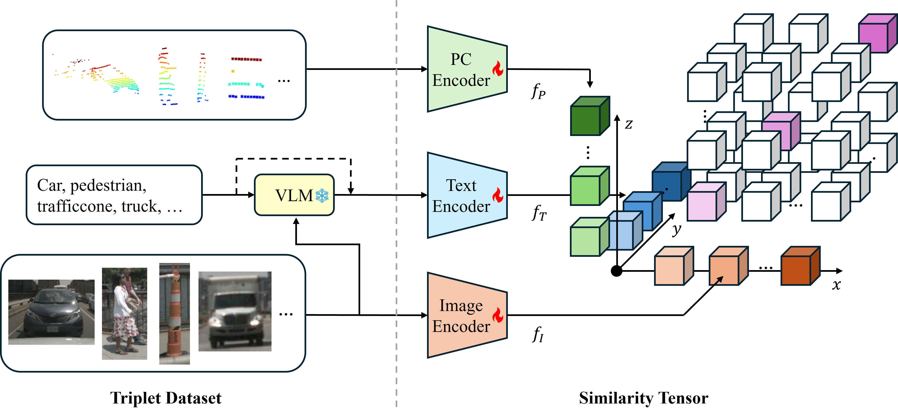

# Toward Unified Multimodal Representation Learning for Autonomous Driving
Overview of Contrastive Tensor Pre-training (CTP). We propose this framework that simultaneously aligns
multiple modalities in a similarity tensor.


<!--  -->
[arXiv](https://arxiv.org/abs/2603.07874)|[BibTeX](#bibtex)

## Requirements
We can create a [conda](https://docs.conda.io/en/latest/) environment named `ctp`:
``` bash
conda create -n ctp python=3.9
```
Then activate the environment and install required libraries:
``` bash
conda activate ctp
```
Install [PyTorch](https://pytorch.org/get-started/locally/) based on your GPU:
``` bash
pip install torch torchvision --index-url https://download.pytorch.org/whl/cu126
```
Install other libraries:
``` bash
pip install tensorboard wandb transformers matplotlib nuscenes-devkit umap-learn pyyaml typeguard git+https://github.com/openai/CLIP.git
```

## Triplet Data Preparation
Triplet data preparation can be divided into two steps. First, we extract annotations, cropped images, and the corresponding point clouds. Then, the images and annotations are fed into a VLM ([Qwen3-VL-8B-Instruct](https://huggingface.co/Qwen/Qwen3-VL-8B-Instruct)) to generate pseudo captions.

### Dataset Structure
```text
dataset/
├── nuscenes_triplets/
│   ├── nuscenes_image/
│   ├── nuscenes_lidar/
│   ├── nuscenes_triplet_train.jsonl
│   └── nuscenes_triplet_val.jsonl
├── kitti_triplets/
│   ├── kitti_image/
│   ├── kitti_lidar/
│   └── kitti_triplet_train.jsonl
└── waymo_triplets/
    ├── waymo_image/
    ├── waymo_lidar/
    └── waymo_triplet_val.jsonl
```
### Metadata Format
Each line in the `.jsonl` file represents a single triplet sample. For example:
```json
{
  "label": "trafficcone",
  "image_path": "nuscenes_image/val/val_0_0_trafficcone.png",
  "lidar_path": "nuscenes_lidar/val/val_0_0_trafficcone.npy",
  "bbox": [0.966, -5.245, 0.659, 0.291, 0.302, 1.265, 1.551],
  "caption": "The traffic cone is orange with a white reflective band near the top, has a conical geometry tapering to a point, and features a black and yellow reflective strip near its base."
}
```

### Training Triplet Dataset
``` bash
python3 ./TripletBuilder.py --dataset nuscenes --data_path /PATH/TO/NUSCENES/DATASET --split train
```

```bash
python3 ./CaptionGen.py --jsonl_path dataset/nuscenes_triplets/nuscenes_triplet_train.jsonl
```
### Test Triplet Dataset
- NuScenes
``` bash
python3 ./TripletBuilder.py --dataset nuscenes --data_path /PATH/TO/NUSCENES/DATASET --split val
```
``` bash
python3 ./CaptionGen.py --jsonl_path dataset/nuscenes_triplets/nuscenes_triplet_val.jsonl
```
- KITTI
``` bash
python3 ./TripletBuilder.py --dataset kitti --data_path /PATH/TO/KITTI/DATASET
```
``` bash
python3 ./CaptionGen.py --jsonl_path dataset/kitti_triplets/kitti_triplet_train.jsonl
```
- Waymo

To generate the Waymo triplet dataset, first create a separate environment named `waymo`:
``` bash
conda create -n waymo python=3.9
conda activate waymo
```
Install the required dependencies:
``` bash
pip install numpy pandas pyarrow pillow tqdm scipy open3d waymo-open-dataset-tf-2-12-0
```
Then generate the triplet data and pseudo captions:
```  bash
python3 ./TripletBuilder_waymo.py --data_path /PATH/TO/WMOD/DATASET --segment_filter {0..49}
```
``` bash
python3 ./CaptionGen.py --jsonl_path dataset/waymo_triplets/waymo_triplet_val.jsonl
```
After finishing the data generation, you can switch back to the `ctp` environment:
``` bash
conda activate ctp
```
## Training Models
To train a model, simply provide a configuration file. The configuration files can be modified in the `./configs` folder.
``` bash
python3 ./train.py --config configs/default.yaml
```
Configuration Options:
- **masked** (`True` / `False`): Whether to use the masking strategy.
- **pc_only** (`True` / `False`): Whether to train only the point cloud encoder or all encoders.
- **use_tb** (`True` / `False`): Whether to enable TensorBoard logging.
- **use_wandb** (`True` / `False`): Whether to enable Weights & Biases logging. Run `wandb login` first to authenticate.

## Evaluation
### Zero-shot Classification Accuracy
To evaluate a trained model, first set **`checkpoint_path`** in the configuration file. Then choose an evaluation dataset from the following options:

- `dataset/nuscenes_triplets/nuscenes_triplet_val.jsonl`
- `dataset/kitti_triplets/kitti_triplet_train.jsonl`
- `dataset/waymo_triplets/waymo_triplet_val.jsonl`

For example:

```bash
python3 ./eval_acc.py --config configs/default.yaml --eval_path dataset/nuscenes_triplets/nuscenes_triplet_val.jsonl --tau 0.5
```
The parameter **`tau`** controls modality usage during evaluation:

- **`tau = 0`**: Only the point cloud modality is used.
- **`tau = 1`**: Only the image modality is used.
- **`tau = 0.5`**: Both modalities are jointly evaluated.
### Alignment
To evaluate the alignment effect, high-dimensional features are projected onto a 2D plane to compare representations before and after alignment.

Run the example command:
``` bash
python3 ./eval_align.py --config configs/default.yaml --eval_path dataset/nuscenes_triplets/nuscenes_triplet_train.jsonl --after_ckpt PATH/TO/CHECKPOINT --label car
```
Arugments:
- **`--eval_path`**  
  Supported evaluation datasets:

  - `dataset/nuscenes_triplets/nuscenes_triplet_val.jsonl`
  - `dataset/kitti_triplets/kitti_triplet_train.jsonl`
  - `dataset/waymo_triplets/waymo_triplet_val.jsonl`

- **`--after_ckpt`**: Path to the checkpoint file you want to evaluate.

- **`--label`**: Object category used to visualize alignment effects. Supported labels include:
  - `"car"`
  - `"truck"`
  - `"pedestrian"`

## BibTeX
```
@misc{tao2026ctp,
      title={Toward Unified Multimodal Representation Learning for Autonomous Driving}, 
      author={Ximeng Tao and Dimitar Filev and Gaurav Pandey},
      year={2026},
      eprint={2603.07874},
      archivePrefix={arXiv},
      primaryClass={cs.CV},
      url={https://arxiv.org/abs/2603.07874}, 
}
```
